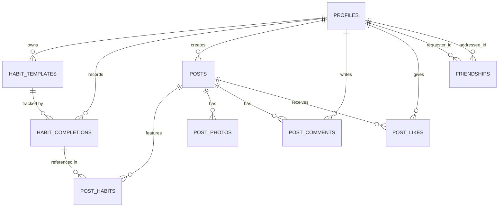

# Habbit Supabase Data Schema

## Table of Contents

- [Tables](#tables)
  - [profiles](#profiles)
  - [habit_templates](#habit_templates)
  - [habit_completions](#habit_completions)
  - [posts](#posts)
  - [post_habits](#post_habits)
  - [post_photos](#post_photos)
  - [post_comments](#post_comments)
  - [post_likes](#post_likes)
  - [friendships](#friendships)
- [Derived Data](#derived-data)
- [Storage Buckets](#storage-buckets)
- [Row Level Security (RLS) Summary](#row-level-security-rls-summary)
- [Entity Relationship Diagram](#entity-relationship-diagram)

---

## Tables

### `profiles`

Extends Supabase `auth.users`. A row is created automatically on sign-up via a trigger.

| Column         | Type          | Constraints                        | Notes                                       |
|----------------|---------------|------------------------------------|---------------------------------------------|
| `id`           | `uuid`        | PK, REFERENCES `auth.users.id`     |                                             |
| `username`     | `text`        | UNIQUE NOT NULL                    |                                             |
| `display_name` | `text`        |                                    |                                             |
| `avatar_url`   | `text`        |                                    | Path in Supabase Storage `avatars` bucket   |
| `bio`          | `text`        |                                    |                                             |
| `created_at`   | `timestamptz` | DEFAULT `now()`                    |                                             |
| `updated_at`   | `timestamptz` | DEFAULT `now()`                    |                                             |

---

### `habit_templates`

Reusable habit definitions owned by a user. When `is_active = true`, the habit appears in the user's daily list from `activated_at` onward.

| Column         | Type          | Constraints                          | Notes                                                                  |
|----------------|---------------|--------------------------------------|------------------------------------------------------------------------|
| `id`           | `uuid`        | PK DEFAULT `gen_random_uuid()`       |                                                                        |
| `user_id`      | `uuid`        | NOT NULL, REFERENCES `profiles.id`   |                                                                        |
| `name`         | `text`        | NOT NULL                             | e.g. "Morning Run"                                                     |
| `description`  | `text`        |                                      |                                                                        |
| `icon`         | `text`        |                                      | SF Symbol name                                                         |
| `color`        | `text`        |                                      | Hex string, e.g. `#FF5733`                                             |
| `is_active`    | `bool`        | NOT NULL DEFAULT `true`              | Whether it generates daily habits                                      |
| `activated_at` | `timestamptz` |                                      | When last activated (used to compute which past days should show this) |
| `created_at`   | `timestamptz` | DEFAULT `now()`                      |                                                                        |
| `updated_at`   | `timestamptz` | DEFAULT `now()`                      |                                                                        |

---

### `habit_completions`

Records a user marking a habit as done on a specific calendar date. Deletions represent unchecking.

| Column           | Type          | Constraints                                     | Notes                            |
|------------------|---------------|-------------------------------------------------|----------------------------------|
| `id`             | `uuid`        | PK DEFAULT `gen_random_uuid()`                  |                                  |
| `user_id`        | `uuid`        | NOT NULL, REFERENCES `profiles.id`              |                                  |
| `template_id`    | `uuid`        | NOT NULL, REFERENCES `habit_templates.id`       |                                  |
| `completed_date` | `timestamptz` | NOT NULL                                        | Calendar date (stored with time) |
| `created_at`     | `timestamptz` | DEFAULT `now()`                                 |                                  |
|                  |               | UNIQUE `(user_id, template_id, completed_date)` | Prevents duplicate completions   |

**Indexes**: `(user_id, completed_date)` for fast calendar and heatmap queries.

---

### `posts`

A user's daily social post sharing habits, a caption, and optional photos.

| Column       | Type          | Constraints                        | Notes                              |
|--------------|---------------|------------------------------------|------------------------------------|
| `id`         | `uuid`        | PK DEFAULT `gen_random_uuid()`     |                                    |
| `user_id`    | `uuid`        | NOT NULL, REFERENCES `profiles.id` |                                    |
| `caption`    | `text`        |                                    | User's written note / comment      |
| `post_date`  | `date`        | NOT NULL                           | The calendar day the post is for   |
| `created_at` | `timestamptz` | DEFAULT `now()`                    |                                    |
| `updated_at` | `timestamptz` | DEFAULT `now()`                    |                                    |

---

### `post_habits`

Junction table linking a post to the specific habit completions the user chose to feature.

| Column          | Type   | Constraints                                        | Notes                                        |
|-----------------|--------|----------------------------------------------------|----------------------------------------------|
| `id`            | `uuid` | PK DEFAULT `gen_random_uuid()`                     |                                              |
| `post_id`       | `uuid` | NOT NULL, REFERENCES `posts.id` ON DELETE CASCADE  |                                              |
| `completion_id` | `uuid` | NOT NULL, REFERENCES `habit_completions.id`        | Ensures the habit was actually completed     |

---

### `post_photos`

Photos attached to a post, stored in Supabase Storage.

| Column         | Type          | Constraints                                       | Notes                                          |
|----------------|---------------|---------------------------------------------------|------------------------------------------------|
| `id`           | `uuid`        | PK DEFAULT `gen_random_uuid()`                    |                                                |
| `post_id`      | `uuid`        | NOT NULL, REFERENCES `posts.id` ON DELETE CASCADE |                                                |
| `storage_path` | `text`        | NOT NULL                                          | Path in the `post-photos` Storage bucket       |
| `position`     | `int2`        | NOT NULL DEFAULT `0`                              | Display order                                  |
| `created_at`   | `timestamptz` | DEFAULT `now()`                                   |                                                |

---

### `post_comments`

Comments left by users on a post.

| Column       | Type          | Constraints                                       | Notes |
|--------------|---------------|---------------------------------------------------|-------|
| `id`         | `uuid`        | PK DEFAULT `gen_random_uuid()`                    |       |
| `post_id`    | `uuid`        | NOT NULL, REFERENCES `posts.id` ON DELETE CASCADE |       |
| `user_id`    | `uuid`        | NOT NULL, REFERENCES `profiles.id`                |       |
| `content`    | `text`        | NOT NULL                                          |       |
| `created_at` | `timestamptz` | DEFAULT `now()`                                   |       |
| `updated_at` | `timestamptz` | DEFAULT `now()`                                   |       |

---

### `post_likes`

Tracks which users have liked a post. Each user can like a post at most once.

| Column       | Type          | Constraints                                       | Notes                      |
|--------------|---------------|---------------------------------------------------|----------------------------|
| `id`         | `uuid`        | PK DEFAULT `gen_random_uuid()`                    |                            |
| `post_id`    | `uuid`        | NOT NULL, REFERENCES `posts.id` ON DELETE CASCADE |                            |
| `user_id`    | `uuid`        | NOT NULL, REFERENCES `profiles.id`                |                            |
| `created_at` | `timestamptz` | DEFAULT `now()`                                   |                            |
|              |               | UNIQUE `(post_id, user_id)`                       | One like per user per post |

---

### `friendships`

Bidirectional friend graph with a status lifecycle: `pending` -> `accepted` or `declined`.

| Column         | Type          | Constraints                                     | Notes                          |
|----------------|---------------|-------------------------------------------------|--------------------------------|
| `id`           | `uuid`        | PK DEFAULT `gen_random_uuid()`                  |                                |
| `requester_id` | `uuid`        | NOT NULL, REFERENCES `profiles.id`              | User who sent the request      |
| `addressee_id` | `uuid`        | NOT NULL, REFERENCES `profiles.id`              | User who received the request  |
| `status`       | `text`        | NOT NULL                                        | `pending`, `accepted`, `declined`, `blocked` |
| `created_at`   | `timestamptz` | DEFAULT `now()`                                 |                                |
| `updated_at`   | `timestamptz` | DEFAULT `now()`                                 |                                |
|                |               | UNIQUE `(requester_id, addressee_id)`           |                                |

**Note**: To check if two users are friends, query for a row where `(requester_id, addressee_id)` or `(addressee_id, requester_id)` exists with `status = 'accepted'`.

---

## Derived Data

### View: `daily_completion_counts`

Aggregates `habit_completions` to power the GitHub-style heatmap calendar.

```sql
CREATE VIEW daily_completion_counts AS
SELECT
  user_id,
  completed_date,
  COUNT(*) AS completion_count
FROM habit_completions
GROUP BY user_id, completed_date;
```

### Function: `get_current_streak(p_user_id uuid)`

Returns the user's current streak (consecutive days with >= 1 completion up to today).
Implemented as a PostgreSQL function using a recursive CTE or date-series approach.

---

## Storage Buckets

| Bucket        | Access                                          | Usage                        |
|---------------|-------------------------------------------------|------------------------------|
| `avatars`     | Private (owner read/write; authenticated read)  | Profile pictures             |
| `post-photos` | Private (owner write; friends read)             | Photos attached to posts     |

---

## Row Level Security (RLS) Summary

| Table               | Read                          | Write                                          |
|---------------------|-------------------------------|------------------------------------------------|
| `profiles`          | Any authenticated user        | Owner only                                     |
| `habit_templates`   | Owner only                    | Owner only                                     |
| `habit_completions` | Owner only                    | Owner only                                     |
| `posts`             | Owner + accepted friends      | Owner only                                     |
| `post_habits`       | Same as parent post           | Owner only                                     |
| `post_photos`       | Same as parent post           | Owner only                                     |
| `post_comments`     | Same as parent post           | Owner (write own); owner (delete own)          |
| `post_likes`        | Same as parent post           | Any authenticated user                         |
| `friendships`       | Either party                  | Requester (create); addressee (update status)  |

---

## Entity Relationship Diagram


